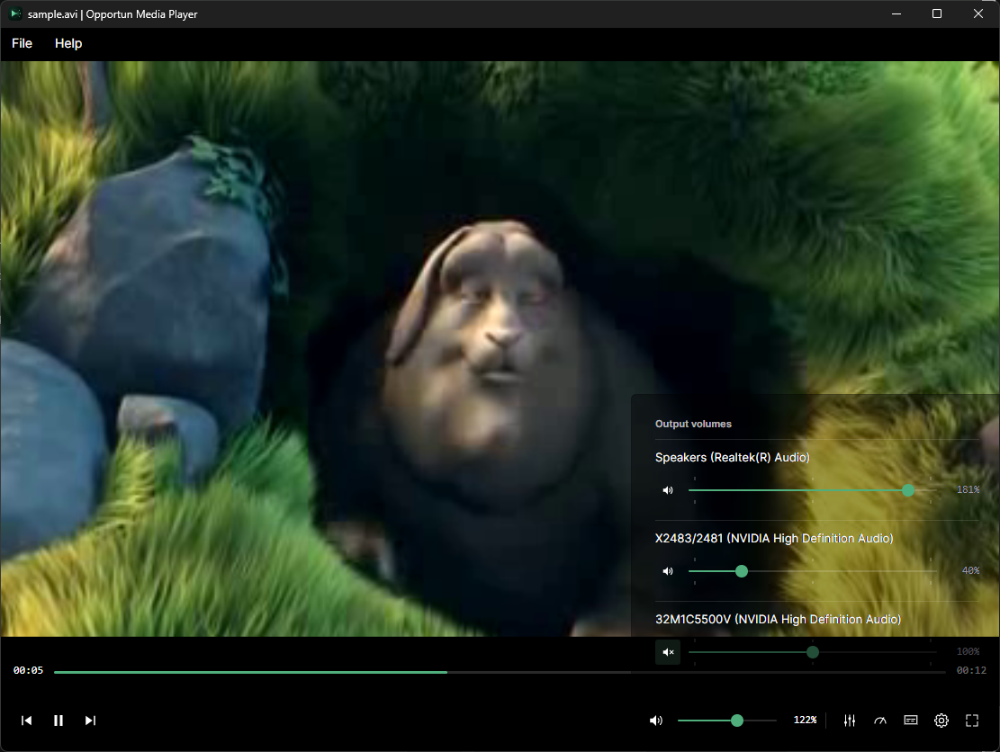
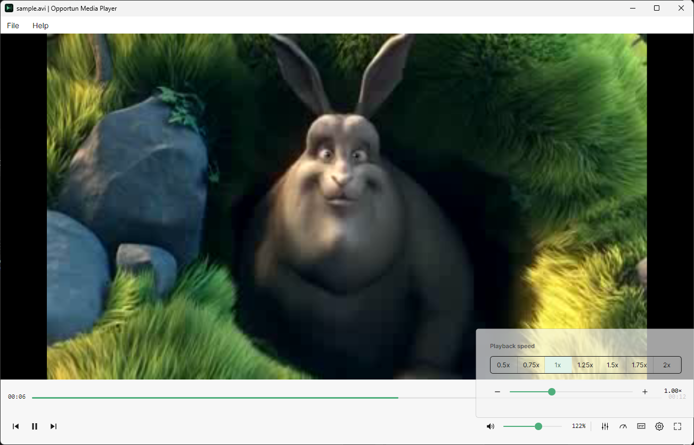
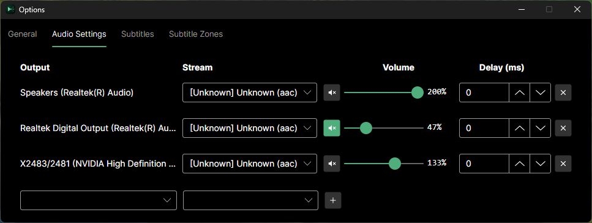
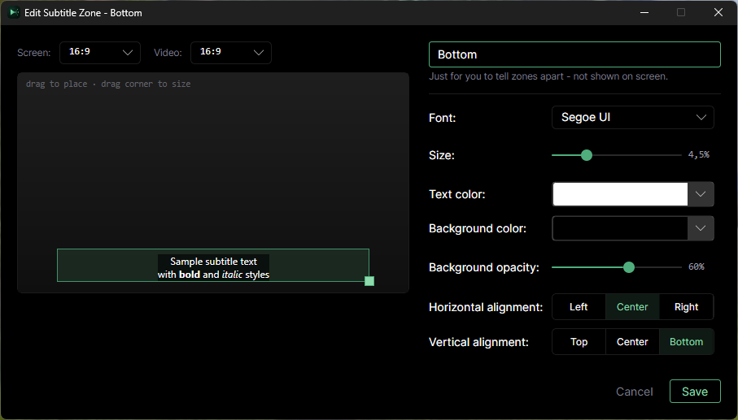

# OMP — Opportun Media Player

[](https://github.com/OpportunV/OpportunMediaPlayer/actions/workflows/ci.yml)
[](https://github.com/OpportunV/OpportunMediaPlayer/releases)
[](LICENSE)

A local media player built on [Avalonia](https://avaloniaui.net/) and FFmpeg. Its headline
feature: route different audio tracks from the same file to different audio output devices
simultaneously — for example, main audio to your speakers and a commentary track to a headset,
playing at the same time.

> Source-available, not OSI open source: free for any noncommercial use, but not under a
> license like MIT/GPL. See [License](#license) below.

## Screenshots

<table>
<tr>
<td align="center" width="50%">
<a href=".github/images/main_window.png"></a>
<br><sub>Main window — dark theme, per-output volume flyout</sub>
</td>
<td align="center" width="50%">
<a href=".github/images/main_window_light_theme.png"></a>
<br><sub>Main window — light theme, playback speed flyout</sub>
</td>
</tr>
<tr>
<td align="center" width="50%">
<a href=".github/images/options_audio_settings.png"></a>
<br><sub>Options → Audio Settings — routing tracks to multiple output devices</sub>
</td>
<td align="center" width="50%">
<a href=".github/images/subtitle_zone_editor.png"></a>
<br><sub>Subtitle zone editor — position, font, and color per zone</sub>
</td>
</tr>
</table>

## Features

- **Multi-output audio routing** — assign any audio track to any output device; the same track
  can be sent to multiple devices at once, each with independent volume.
- **Per-output and master volume**, 0–200%, composed multiplicatively (each slider's feel stays
  independent of the other). A quick per-output volume popup sits right on the main toolbar, next
  to the full routing/delay controls in Options.
- **Playback speed control** — 0.5x–2x, YouTube-style presets, pitch-preserving (speeding up or
  slowing down doesn't change pitch).
- **Subtitles with positionable zones** — assign subtitle tracks to on-screen zones you define
  and style.
- **Light / dark / system theme**, applied consistently across the main window, popups, and
  dialogs.
- **In-app keyboard shortcut reference** (Help → Keyboard Shortcuts).

## Keyboard shortcuts

| Keys | Action |
|---|---|
| Space | Play / pause |
| Left Arrow | Step back |
| Right Arrow | Step forward |
| Up Arrow | Increase volume |
| Down Arrow | Decrease volume |
| M | Toggle mute |
| F | Toggle fullscreen |
| C | Toggle subtitles |
| Esc | Exit fullscreen |
| Shift + , | Decrease playback speed |
| Shift + . | Increase playback speed |

Double-clicking the video also toggles fullscreen. The same shortcut list is available from
Help → Keyboard Shortcuts inside the app.

## Platform support

- **Windows x64** — fully supported, native FFmpeg libraries bundled.
- **Linux x64** — native FFmpeg libraries bundled and CI builds/tests pass, but real-world testing
  so far has only been on a single Ubuntu 22.04/24.04 VirtualBox VM — broader distro and desktop
  environment coverage is unverified. If you try it on something else, a report via
  [Issues](https://github.com/OpportunV/OpportunMediaPlayer/issues) is welcome either way.
- **macOS (Apple Silicon and Intel)** — builds are produced by CI, but **not yet verified on real
  hardware** — no Mac has been available to test with. Unlike Windows/Linux, FFmpeg isn't bundled;
  install it yourself first via Homebrew: `brew install ffmpeg@7`. Try it and report back via
  [Issues](https://github.com/OpportunV/OpportunMediaPlayer/issues), good or bad.
- Ships self-contained (bundles its own .NET 10 runtime) — no separate .NET install needed.

## Limitations

These are current, code-level limits, not artificial restrictions — worth knowing before you rely
on OMP for a given file:

**Video**
- Only the first video track in a file is used; files with multiple video tracks (e.g. multi-angle)
  can't switch between them.
- Decoding is software-only — no GPU-accelerated decode. Playback of very high-resolution or
  high-bitrate video is limited by CPU decode speed.
- All video is converted to 8-bit BGRA for display regardless of source bit depth — no HDR or
  10-bit-aware rendering.
- Frame buffers are sized once when a file opens; a stream that changes resolution mid-playback
  is not handled.

**Audio**
- Every audio track is downmixed/converted to 16-bit stereo before playback — no surround-sound
  passthrough and no output above 16-bit, regardless of the source format.
- A given output device can only be assigned to one route at a time (you can't send two different
  tracks to the same speaker simultaneously), but the same track can fan out to multiple devices.

**Subtitles**
- Only text-based subtitle formats are supported: SRT, ASS, SSA, WebVTT, and MOV_TEXT. Bitmap-based
  subtitles (PGS, VobSub/DVD, DVB, XSUB) are detected and listed, but can't be routed or rendered.
- Of ASS/SSA styling, only bold, italic, and line breaks are applied. Color, custom fonts,
  position/movement, karaoke, and animation override tags are ignored. Embedded container fonts
  are not used.

**General**
- Local files only — no network streams or URLs.
- One file open at a time — no playlist or queue.
- No chapter markers.
- No DRM/encrypted content support.

## Download

Pre-built binaries are published on the [Releases page](https://github.com/OpportunV/OpportunMediaPlayer/releases):

- **Windows** — `OMP-Setup-<version>.exe` (installer) or `OMP-<version>-win-x64-portable.zip`
  (no install required)
- **Linux** — `OMP-<version>-x86_64.AppImage` or `OMP-<version>-linux-x64-portable.tar.gz`
- **macOS** — `OMP-<version>-osx-arm64-portable.tar.gz` (Apple Silicon) or
  `OMP-<version>-osx-x64-portable.tar.gz` (Intel). Unsigned/not notarized, so Gatekeeper will
  refuse to launch it normally — clear the quarantine flag first: `xattr -cr OMP-*` after
  extracting, or right-click the `OMP` executable and choose Open. Also requires
  `brew install ffmpeg@7` beforehand.

Building from source (below) is only needed if you want an unreleased change from `develop` or
there's no release for your platform yet.

## Building from source

Requires the [.NET 10 SDK](https://dotnet.microsoft.com/).

```bash
dotnet build OMP.Ui/OMP.Ui.csproj
dotnet run --project OMP.Ui/OMP.Ui.csproj
```

Unit tests (pure logic only, instant, no native dependencies):

```bash
dotnet test OMP.Lib.Tests/OMP.Lib.Tests.csproj
```

Integration tests (opens real files from `test-fixtures/` through the real engine — needs a
runtime identifier so the matching native FFmpeg libraries get bundled; swap `win-x64` for
`linux-x64` or `osx-arm64`/`osx-x64` as appropriate):

```bash
dotnet test OMP.Lib.IntegrationTests/OMP.Lib.IntegrationTests.csproj -r win-x64
```

## Issues and feedback

Bug reports and feature requests are welcome via [GitHub Issues](https://github.com/OpportunV/OpportunMediaPlayer/issues).

## License

[PolyForm Noncommercial 1.0.0](LICENSE) — free to use, modify, and share for any noncommercial
purpose, with attribution. This is a source-available license, not an OSI-approved open-source
one (no MIT/GPL/Apache-style unrestricted use) — commercial use is not permitted without a
separate agreement.
